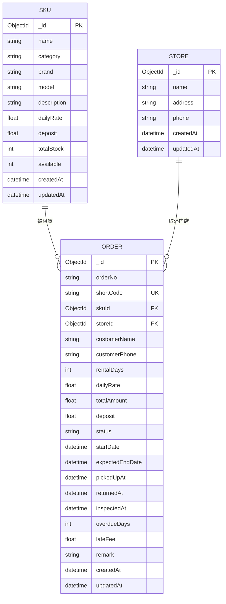

# 乐行连锁 - 乐器租赁系统

## 集合结构说明 (MongoDB)

### 1. `skus` 集合 - 商品库存单元

```json
{
  "_id": ObjectId,
  "name": "雅马哈 C40 古典吉他",
  "category": "string",
  "brand": "Yamaha",
  "model": "C40",
  "description": "入门级古典吉他，适合初学者",
  "dailyRate": 15.0,
  "deposit": 500.0,
  "totalStock": 10,
  "available": 10,
  "imageUrl": "",
  "createdAt": ISODate,
  "updatedAt": ISODate
}
```

**字段说明:**
- `category`: 乐器分类，可选值 `string`(弦乐)、`wind`(管乐)、`percussion`(打击)、`keyboard`(键盘)、`electronic`(电子)
- `dailyRate`: 日租金（元/天）
- `deposit`: 押金（元）
- `totalStock`: 总库存数量
- `available`: 可租数量（= 总库存 - 已租出数量）
- **约束**: `available >= 0`，通过 MongoDB 事务保证库存不为负

**SKU 删除策略:**
- 采用**硬删除**方式（`DeleteOne`）
- 删除前校验：若存在 `pending` / `paid` / `picked_up` / `overdue` / `returned` 状态的在途订单，则拒绝删除并提示在途订单数量
- 仅当该 SKU 无任何在途订单时允许删除

---

### 2. `stores` 集合 - 门店

```json
{
  "_id": ObjectId,
  "name": "乐行琴行·旗舰店",
  "address": "北京市朝阳区建国路88号",
  "phone": "010-88888888",
  "createdAt": ISODate,
  "updatedAt": ISODate
}
```

---

### 3. `orders` 集合 - 订单

```json
{
  "_id": ObjectId,
  "orderNo": "YX2H7K9M4P",
  "shortCode": "A1B2C3",
  "skuId": ObjectId,
  "customerName": "张三",
  "customerPhone": "13800138000",
  "storeId": ObjectId,
  "rentalDays": 7,
  "dailyRate": 15.0,
  "totalAmount": 105.0,
  "deposit": 500.0,
  "status": "pending",
  "startDate": ISODate,
  "expectedEndDate": ISODate,
  "pickedUpAt": ISODate,
  "returnedAt": ISODate,
  "inspectedAt": ISODate,
  "overdueDays": 0,
  "lateFee": 0.0,
  "remark": "",
  "createdAt": ISODate,
  "updatedAt": ISODate
}
```

**字段说明:**
- `orderNo`: 订单号，格式 `YX` + 8位随机字符
- `shortCode`: 6位短码，用于门店扫码操作，唯一
- `rentalDays`: 租赁天数
- `totalAmount`: `rentalDays * dailyRate`
- `overdueDays`: 逾期天数，`max(0, 实际归还日期 - 预计归还日期)`
- `lateFee`: 滞纳金，`totalAmount * 0.01 * overdueDays`

**索引:**
- `{ "shortCode": 1 }` - 唯一索引，用于快速查询
- `{ "customerPhone": 1 }` - 用户查询订单
- `{ "status": 1, "createdAt": -1 }` - 订单列表筛选和排序

---

## ER 关系图 (Mermaid)



---

## 库存流转逻辑

```
┌─────────────────┐     下单扣减     ┌─────────────────┐
│  available = 5  │ ─────────────> │  available = 4  │
│  totalStock = 10│                │  totalStock = 10│
└─────────────────┘                └─────────────────┘
          │                                │
          │ 取消订单归还库存                │ 用户取货
          ▼                                ▼
┌─────────────────┐                ┌─────────────────┐
│  available = 5  │                │  available = 4  │
│  totalStock = 10│                │  totalStock = 10│
└─────────────────┘                └─────────────────┘
                                           │
                                           │ 用户归还
                                           ▼
                                  ┌─────────────────┐
                                  │  available = 4  │
                                  │  totalStock = 10│
                                  └─────────────────┘
                                           │
                                           │ 质检通过 +1
                                           ▼
                                  ┌─────────────────┐
                                  │  available = 5  │
                                  │  totalStock = 10│
                                  └─────────────────┘
```

### 事务保证
- **创建订单**: 使用 MongoDB 事务，先通过 `{ available: { $gt: 0 } }` 乐观锁扣减库存，再创建订单
- **取消订单**: 事务内同时 `available + 1` 和更新订单状态
- **质检通过**: 事务内同时 `available + 1` 和更新订单状态

### 库存约束
- `available >= 0` 通过乐观锁保证
- 更新 `totalStock` 时，`newAvailable = oldAvailable + (newTotal - oldTotal)`
- 若 `newAvailable < 0` 则拒绝更新
