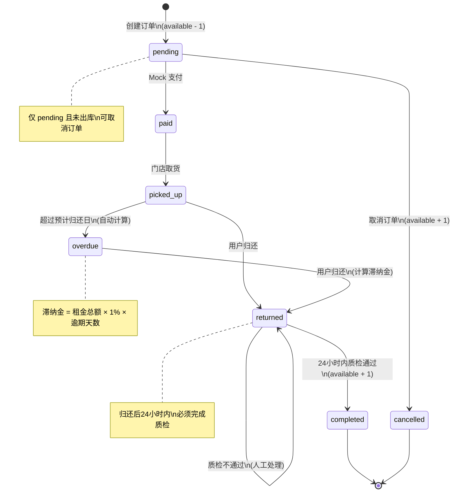

# 订单状态流转图

## 状态列表

| 状态 | 英文标识 | 说明 |
|------|---------|------|
| 待支付 | `pending` | 订单已创建，等待支付 |
| 已支付 | `paid` | 支付成功，等待用户取货 |
| 已取货 | `picked_up` | 用户已取走乐器 |
| 已逾期 | `overdue` | 超过预计归还日期未归还（自动计算） |
| 已归还 | `returned` | 用户已归还乐器，等待质检 |
| 已完成 | `completed` | 质检通过，订单完成，押金退还 |
| 已取消 | `cancelled` | 用户或系统取消订单 |

---

## 状态流转图 (Mermaid)



---

## 详细流转规则

### 1. pending → paid (支付)
- **触发**: `POST /api/v1/orders/pay`
- **条件**: 订单状态为 `pending`
- **操作**:
  - 更新订单状态为 `paid`
  - 记录 Mock 支付成功

### 2. pending → cancelled (取消订单)
- **触发**: `POST /api/v1/orders/:id/cancel`
- **条件**: 
  - 订单状态必须为 `pending`
  - `pickedUpAt` 必须为 `null`（未出库）
- **操作**:
  - MongoDB 事务：`available + 1`
  - 更新订单状态为 `cancelled`
- **注意**: 其他状态的订单不允许取消

### 3. paid → picked_up (取货)
- **触发**: 
  - `POST /api/v1/orders/pickup`
  - `POST /api/v1/orders/scan` (action=pickup，扫码)
- **条件**: 订单状态为 `paid`
- **操作**:
  - 记录 `pickedUpAt` 时间戳
  - 更新订单状态为 `picked_up`

### 4. picked_up → overdue (逾期)
- **触发**: 自动计算（查询时）
- **条件**: `now() > expectedEndDate` 且状态为 `picked_up`
- **操作**:
  - 计算 `overdueDays = ceil(now - expectedEndDate)`
  - 计算 `lateFee = totalAmount * 0.01 * overdueDays`
  - 状态标记为 `overdue`
- **注意**: 数据库中不主动更新，查询时实时计算

### 5. picked_up/overdue → returned (归还)
- **触发**:
  - `POST /api/v1/orders/return`
  - `POST /api/v1/orders/scan` (action=return，扫码)
- **条件**: 订单状态为 `picked_up` 或 `overdue`
- **操作**:
  - 记录 `returnedAt` 时间戳
  - 计算并保存 `overdueDays` 和 `lateFee`
  - 更新订单状态为 `returned`

### 6. returned → completed (质检通过)
- **触发**:
  - `POST /api/v1/orders/inspect`
  - `POST /api/v1/orders/scan` (action=inspect，扫码)
- **条件**:
  - 订单状态为 `returned`
  - `now() - returnedAt <= 24小时`
- **操作**:
  - MongoDB 事务：`available + 1`
  - 记录 `inspectedAt` 时间戳
  - 更新订单状态为 `completed`
- **质检不通过**: 需人工处理，状态保持 `returned`

---

## 扫码操作对应状态

管理端通过扫码订单短码，可执行以下操作：

| 操作 | 对应状态流转 | 前置状态 |
|------|-------------|---------|
| `pickup` (取货) | paid → picked_up | 已支付 |
| `return` (归还) | picked_up/overdue → returned | 已取货/已逾期 |
| `inspect` (质检) | returned → completed | 已归还（24h内） |

**扫码 API**: `POST /api/v1/orders/scan`
```json
{
  "shortCode": "A1B2C3",
  "action": "pickup"
}
```

---

## 滞纳金计算规则

```
逾期天数 = ceil( (归还日期 - 预计归还日期) / 24小时 )

若逾期天数 > 0:
  滞纳金 = 租金总额 × 1% × 逾期天数

示例:
  租金总额 = ¥1000
  逾期 3 天
  滞纳金 = 1000 × 0.01 × 3 = ¥30
```
